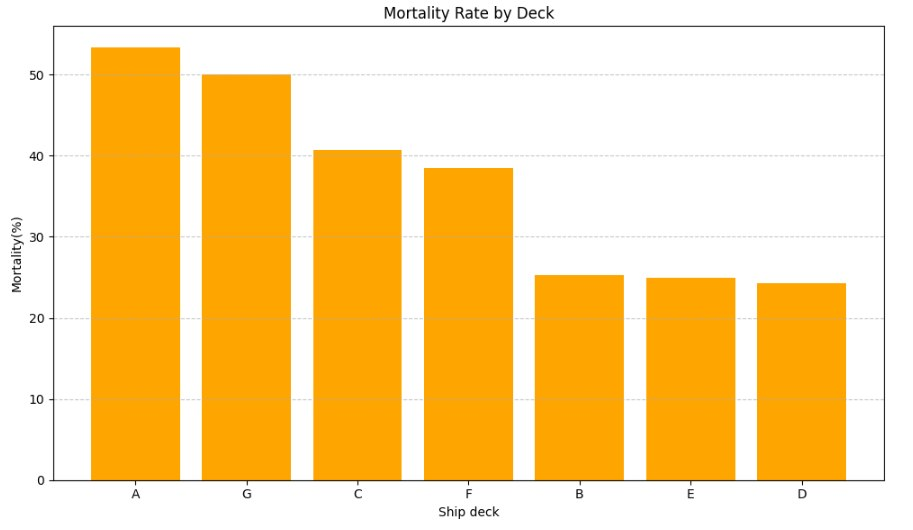
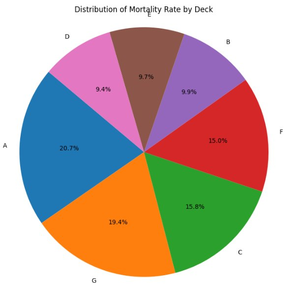
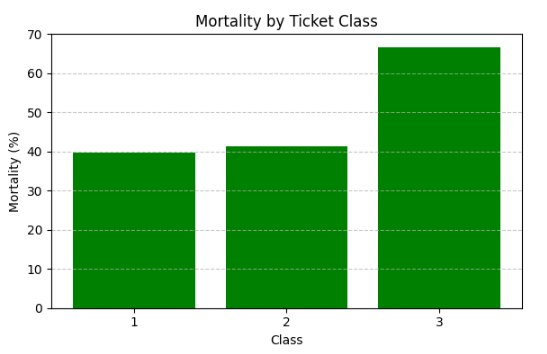
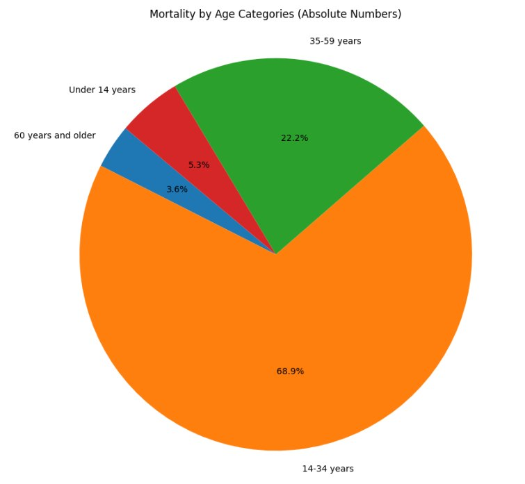
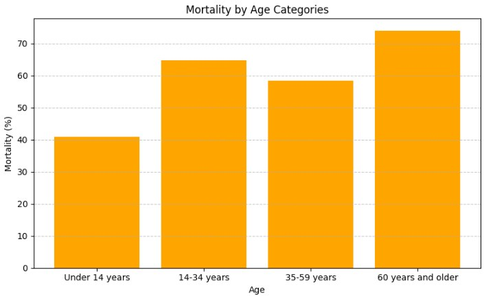

# 🚢 Titanic Survival Analysis (Python EDA Project)

## 📊 Key Visualizations

  
  

  
  

  
  

This project explores the Titanic dataset to identify key factors influencing passenger survival.

## 📊 Project Overview
The goal of this analysis is to understand how different variables such as gender, age, passenger class, and family size impacted survival rates.

## 🎯 Business Goal
Identify patterns in survival behavior that can be used to:
- Understand risk factors
- Segment users (passengers)
- Support data-driven decision-making

## 🛠 Tools Used
- Python
- Pandas
- NumPy
- Matplotlib
- Seaborn
- Jupyter Notebook

## 🔍 Key Analysis Steps
- Data cleaning and preprocessing
- Exploratory Data Analysis (EDA)
- Handling missing values
- Feature analysis (age, class, gender, fare, family size)
- Data visualization

## 📈 Key Insights
- Women had significantly higher survival rates than men
- First-class passengers had better chances of survival
- Younger passengers had slightly higher survival probability
- Traveling alone vs with family influenced survival outcomes

## 📊 Visualizations
The project includes:
- Survival distribution by gender
- Survival by passenger class
- Age distribution
- Correlation heatmap

## 🚀 Project Files
- `Halyna_Lanovska_titanic.ipynb` — main analysis notebook

## 📎 Dataset
Seaborn built-in Titanic dataset

---

👩‍💻 Author: Halyna Lanovska
